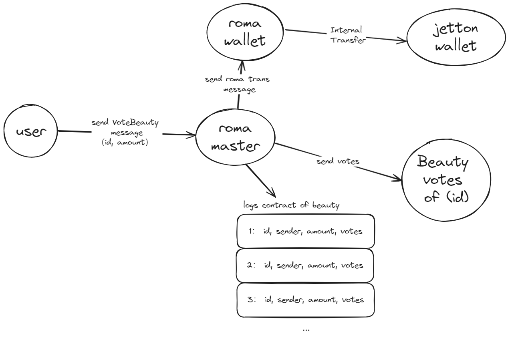
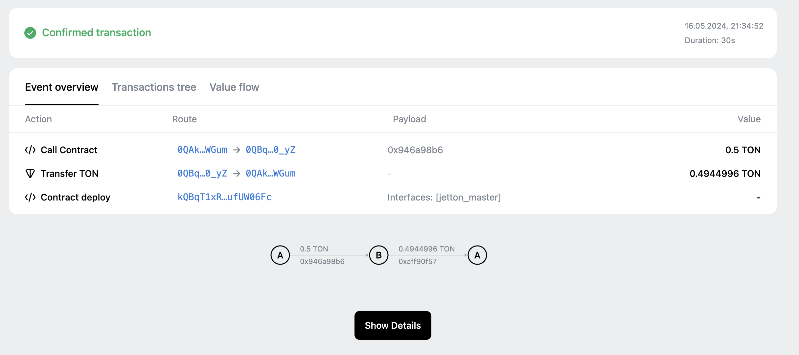
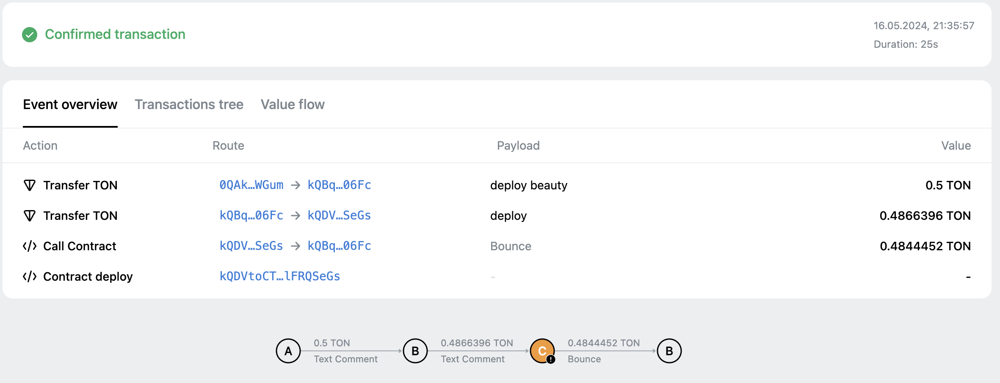
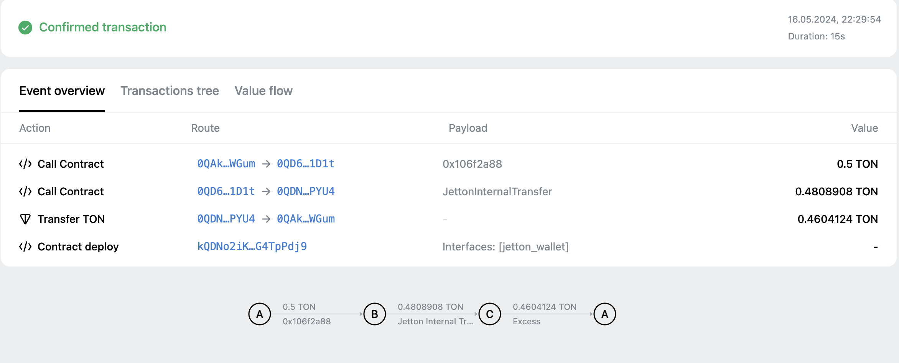
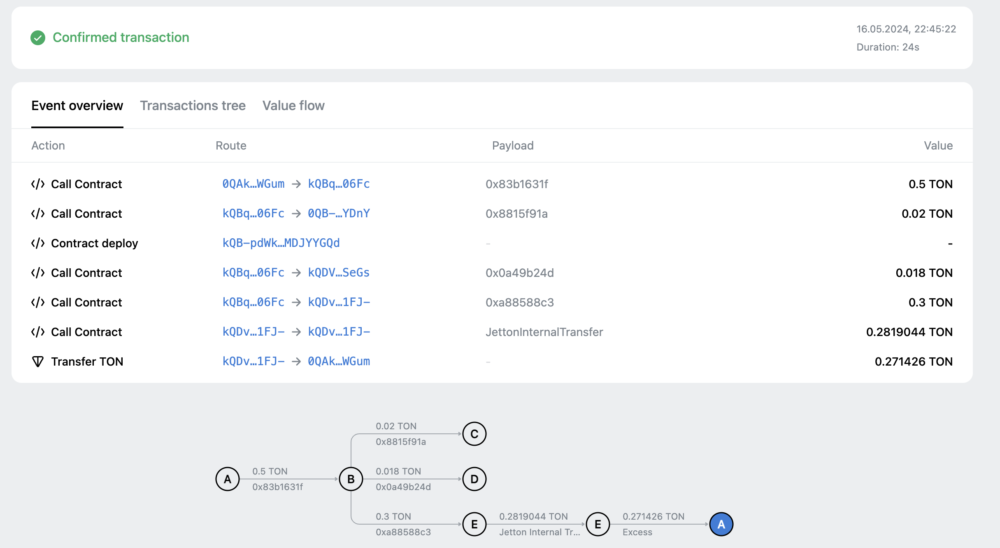
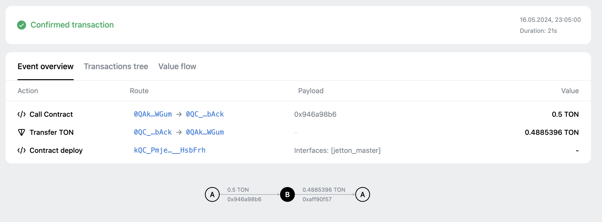

# beauty
## Complete Process

## How to use

`npm run install`


### Build

`npm run build` 

### Test

`npm run test`

### Deploy or run another script

`npm run start`


## Tutorial
具体操作参考scripts以及tests部分实现，核心调用都已列出，其他未提及的依样画葫芦即可，缺少的功能可在合约中添加重新build再部署。
1. 部署投票币合约
详见[./scripts/deployMswvote.ts](./scripts/deployMswvote.ts)
执行命令
```
npm run start
```
选择`deployMiswvote` , 部署的消息如下,需要修改Token的Meta Data信息：
```js
// meta data, 根据实际情况修改， image建议用github上的图片地址，后续方便修改图片
const jettonParams = {
        name: "MSWVOTE",
        description: "MISS web3 vote coin",
        symbol: "MSWVOTE",
        image: "https://raw.githubusercontent.com/MewImpetus/beauty/main/logo.png",
    };

    const content = buildOnchainMetadata(jettonParams);
    // 合约管理员
    const owner = Address.parse("UQAkZEqn5O4_yI3bCBzxpLEsO1Z10QSGDK5O4buL9nQrWNAs")
    // 投票币 投票时接受者
    const vote_receiver = Address.parse("UQAkZEqn5O4_yI3bCBzxpLEsO1Z10QSGDK5O4buL9nQrWNAs")
    const mswvote = provider.open(await Mswvote.fromInit(owner, vote_receiver, content));

    // 发送部署消息
    await mswvote.send(
        provider.sender(),
        {
            value: toNano('0.5'),
        },
        {
            $$type: 'Deploy',
            queryId: 0n,
        }
    );

```

合约地址： [kQBqT1xRNjjiAbp4G9vrNOrUnQL9CUYh2elbd-O-ufUW06Fc](https://testnet.tonviewer.com/kQBqT1xRNjjiAbp4G9vrNOrUnQL9CUYh2elbd-O-ufUW06Fc)
2. 部署MISS票数记录的合约，通过投票币合约来部署，自动将合约管理愿员设置为投票币合约地址
```js
await mswvote.send(
        provider.sender(),
        {
            value: toNano('0.5'),  // 给点ton 用于存储数据
        },
        "deploy beauty"
    )
```

合约地址： [kQDVtoCTG5cSOPGDsCcwZQmHIrfkr4YsokRKQbiBlFRQSeGs](https://testnet.tonviewer.com/kQDVtoCTG5cSOPGDsCcwZQmHIrfkr4YsokRKQbiBlFRQSeGs)

3. 管理员挖出一部分的投票币
```js
// mint 1亿
    await mswvote.send(
        provider.sender(),
        {
            value: toNano('0.5'),
        },
        {
            $$type: "Mint",
            to: owner,
            amount: toNano("100000000")
        }
    )
```


4. 给 1号 beauty投票 100 票
```js
await roma.send(
        provider.sender(),
        {
            value: toNano('0.5'),
        },
        {
            $$type: "BeautyVote",
            id: 1n,
            amount: toNano("100")
        }
    );
```


5. 查询票数和日志
执行命令
```
npm run start
```
选择`getInfo`

查询1号beauty的票数，先获得第1位beauty的合约地址，再调用查询票数的函数
```js
const log_counts = await mswvote.getVoteRecordCount()
console.log("log_counts:", log_counts)
```

查询第1条投票日志, 先获取第1条日志的合约地址，然后调用查询记录的函数，并且可以可以通过roma合约的方法获取日志总数n，
只需要从1遍历到n，即可查询到所有的投票日志
```js
const log_address_of_1 = await mswvote.getVoteLogAddress(1n);
const logs = provider.open(VoteLogs.fromAddress(log_address_of_1));
const record = await logs.getVoteRecord();
console.log('record1:', record);
```

6. 部署平台币 msw
执行命令
```
npm run start
```
选择`deployMissw`


平台币地址： [0QC_PmjenIS7xw0P_lYofvaBUt1ZvKngvwh6f5Uu__HsbAck](https://testnet.tonviewer.com/kQC_PmjenIS7xw0P_lYofvaBUt1ZvKngvwh6f5Uu__HsbFrh)

获取可挖矿信息
```js
let mintable = await missw.getMintAbleInfo();
console.log("mintable:", mintable);
```

多种挖矿方式参考 tests/Missw.spec.ts 中注释掉的部分